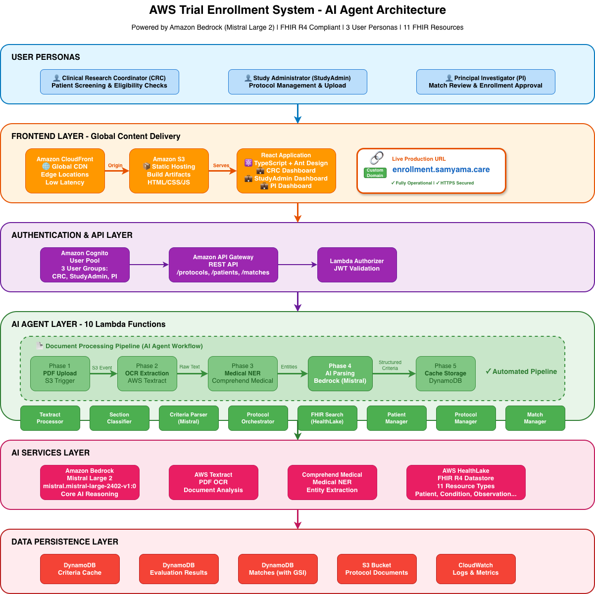
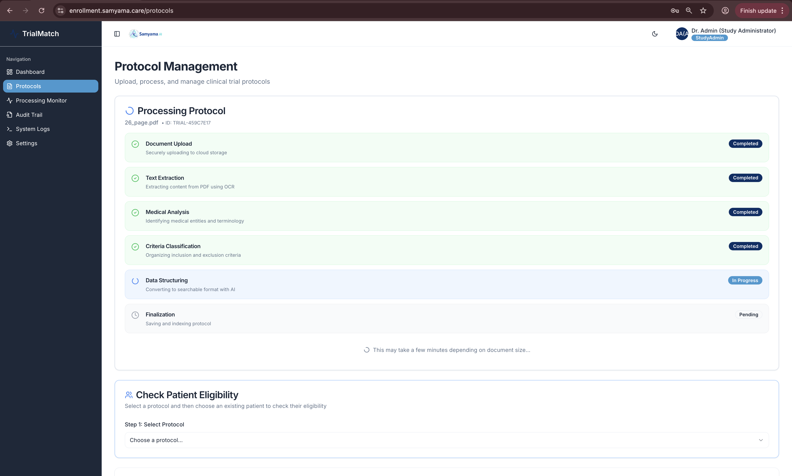
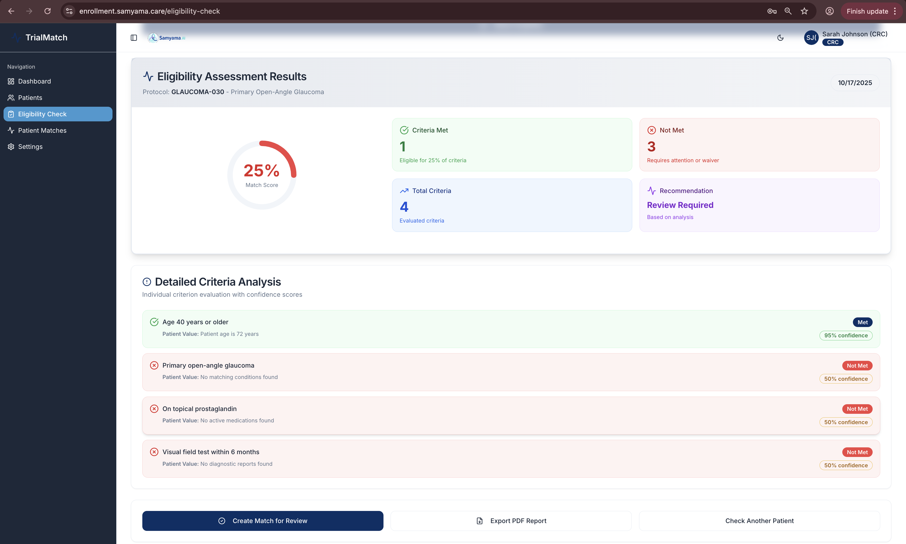
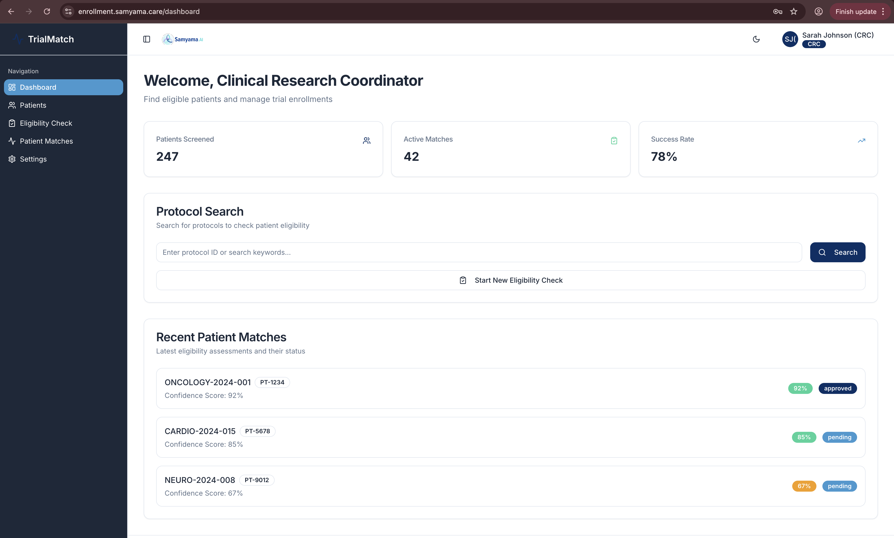
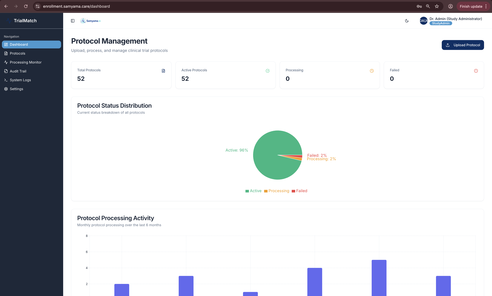
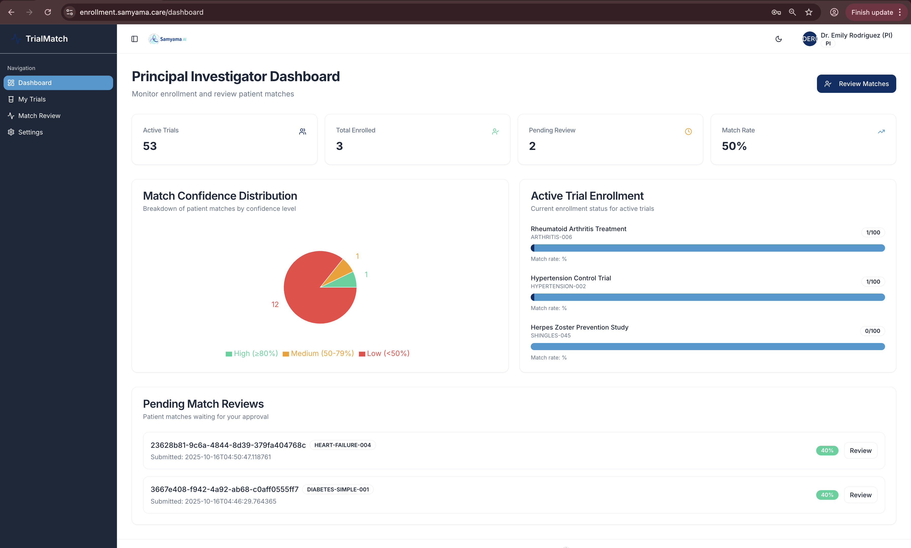

# AWS Trial Enrollment System - Backend

<div align="center">


**AI-Powered Clinical Trial Patient Matching with Amazon Bedrock (Mistral Large 2)**

[Live Demo](https://enrollment.samyama.care) • [Frontend Repo](https://github.com/VaidhyaMegha/trial-compass-pro) • [AWS Hackathon](https://aws-agent-hackathon.devpost.com/)

</div>

---

## 🎯 Overview

**AWS Trial Enrollment System** is an autonomous AI agent that revolutionizes clinical trial enrollment by automating patient-trial matching. Built for the **AWS AI Agent Global Hackathon 2025**, this system reduces enrollment time from **weeks to minutes** using intelligent automation powered by **Amazon Bedrock with Mistral Large 2**.

### The Problem

**85% of clinical trials fail due to slow patient enrollment.** Traditional manual screening is:
- Time-consuming (weeks of coordinator effort)
- Error-prone (manual criteria interpretation)
- Expensive (millions in delayed drug development)
- Inconsistent (subjective eligibility decisions)

### Our Solution

An intelligent AI agent that:
- 📄 **Parses** clinical trial protocols using AWS Textract and Mistral Large 2
- 🔍 **Analyzes** patient health records from AWS HealthLake (FHIR R4)
- 🧠 **Matches** patients to trials with explainable AI reasoning
- 📊 **Generates** confidence-scored eligibility reports

---

## 🏗️ Architecture



### 6-Layer Architecture

1. **User Personas Layer**: CRC, StudyAdmin, PI with role-based access
2. **Frontend Layer**: CloudFront CDN → S3 → React Application
3. **Authentication & API Layer**: Cognito (3 user groups) → API Gateway → Lambda Authorizer
4. **AI Agent Layer**: 10 Lambda functions orchestrating the AI pipeline
5. **AI Services Layer**: Bedrock (Mistral Large 2), Textract, Comprehend Medical, HealthLake
6. **Data Persistence Layer**: 3 DynamoDB tables, S3, CloudWatch

---

## ✨ Key Features

### 🤖 Autonomous AI Agent Pipeline



**6-Phase Automated Protocol Processing:**
1. **Document Upload** - Secure upload to S3
2. **Text Extraction** - AWS Textract OCR from PDF
3. **Medical Analysis** - AWS Comprehend Medical entity extraction
4. **Criteria Classification** - Organize inclusion/exclusion criteria
5. **Data Structuring** - Amazon Bedrock (Mistral Large 2) parsing
6. **Finalization** - Save to DynamoDB cache

### 🎯 Intelligent Eligibility Matching



**AI-Powered Patient Matching with:**
- **Mistral Large 2** reasoning for complex medical criteria
- **Confidence scores** (0-100%) for each criterion
- **Criterion-by-criterion explanations** with evidence
- **FHIR resource integration** (11 resource types)
- **Transparent decision-making** with audit trails

### 📊 Three User Personas

#### Clinical Research Coordinator (CRC)

- Patient screening and eligibility checking
- View match confidence scores
- Track success rates (78% in demo)

#### Study Administrator (StudyAdmin)

- Protocol upload and management
- Monitor processing pipeline
- Track protocol status distribution

#### Principal Investigator (PI)

- Enrollment oversight across trials
- Review pending matches
- Approve/reject enrollments
- Export professional reports

---

## 🛠️ Technology Stack

### AWS Services (11 Total)

| Service | Purpose | Usage |
|---------|---------|-------|
| **Amazon Bedrock** | LLM Reasoning | Mistral Large 2 (`mistral.mistral-large-2402-v1:0`) for criteria parsing and eligibility decisions |
| **AWS Lambda** | Serverless Compute | 10 functions for agent execution |
| **AWS HealthLake** | FHIR R4 Datastore | Patient health records (11 resource types) |
| **AWS Textract** | Document OCR | Extract text from protocol PDFs |
| **Amazon Comprehend Medical** | Medical NLP | Entity extraction and NER |
| **Amazon DynamoDB** | NoSQL Database | 3 tables: criteria cache, evaluation results, matches |
| **Amazon Cognito** | Authentication | User pools with 3 groups (CRC, StudyAdmin, PI) |
| **Amazon API Gateway** | REST API | API endpoints for frontend integration |
| **Amazon S3** | Object Storage | Protocol documents and static website hosting |
| **Amazon CloudFront** | CDN | Global content delivery |
| **Amazon CloudWatch** | Observability | Logging, monitoring, tracing |

### Additional Technologies

- **Infrastructure as Code**: AWS CDK (Python)
- **Backend**: Python 3.11+ with AWS Lambda Powertools
- **Frontend**: React + TypeScript + Tailwind CSS
- **FHIR Compliance**: FHIR R4 standard (11 resource types)
- **Testing**: pytest with 93% pass rate

---

## 📋 FHIR Resource Support

Supports **11 FHIR R4 resource types** for comprehensive patient data:

1. **Patient** - Demographics, birthDate, gender
2. **Condition** - Diagnoses, ICD-10 codes
3. **Observation** - Lab values, vital signs
4. **MedicationStatement** - Current medications
5. **AllergyIntolerance** - Allergies and intolerances
6. **Procedure** - Surgical history
7. **Immunization** - Vaccination records
8. **DiagnosticReport** - Lab reports
9. **Encounter** - Healthcare visits
10. **CarePlan** - Treatment plans
11. **FamilyMemberHistory** - Family medical history

---

## 🚀 Quick Start

### Prerequisites

- AWS Account with:
  - Amazon Bedrock access (Mistral Large 2 enabled in us-east-1)
  - HealthLake permissions
  - Lambda, API Gateway, and DynamoDB permissions
- Python 3.11+
- AWS CLI configured
- Node.js 18+ (for AWS CDK)

### Installation

```bash
# 1. Clone the repository
git clone https://github.com/VaidhyaMegha/aws-trial-enrollment-agent.git
cd aws-trial-enrollment-agent

# 2. Create virtual environment
python -m venv venv
source venv/bin/activate  # On Windows: venv\Scripts\activate

# 3. Install dependencies
pip install -r requirements.txt

# 4. Configure AWS credentials
aws configure
# Set region to us-east-1 for Bedrock access

# 5. Deploy infrastructure
cd infrastructure
npm install -g aws-cdk
pip install -r requirements.txt
cdk deploy --require-approval never

# 6. Load synthetic patient data
cd ../scripts
python3 upload_to_healthlake.py
```

### Enable Bedrock Model Access

1. Go to AWS Console → Bedrock → Model access
2. Enable **Mistral Large 2** (`mistral.mistral-large-2402-v1:0`)
3. Wait for approval (usually instant)

---

## 📦 Project Structure

```
aws-trial-enrollment-agent/
├── docs/                             # Documentation
│   ├── PROTOCOL_PROCESSING_GUIDE.md  # Protocol processing guide
│   ├── DEMO_VIDEO_SCRIPT.md          # 3-minute demo video script
│   ├── screenshots/                  # 15 demo screenshots
│   └── AWS Hackathon Idea _ v1.md    # Original concept
├── src/                              # Source code
│   ├── lambda/                       # Lambda functions
│   │   ├── criteria_parser/          # Mistral Large 2 parsing (core AI)
│   │   ├── fhir_search/              # HealthLake FHIR queries
│   │   ├── textract_processor/       # PDF text extraction
│   │   ├── section_classifier/       # Comprehend Medical classification
│   │   ├── protocol_orchestrator/    # Pipeline orchestration
│   │   ├── protocol_manager/         # Protocol CRUD operations
│   │   ├── patient_manager/          # Patient data management
│   │   ├── match_manager/            # Patient-protocol matching
│   │   ├── admin_manager/            # System administration
│   │   └── authorizer/               # JWT authentication
│   ├── agent/                        # Agent configuration
│   └── utils/                        # Shared utilities
├── infrastructure/                   # AWS CDK Infrastructure
│   └── app.py                        # CDK stack definition
├── scripts/                          # Utility scripts
│   ├── process_protocol_pdf.py       # End-to-end protocol processor
│   ├── load_synthea_data.py          # Generate synthetic FHIR data
│   ├── upload_to_healthlake.py       # Upload patients to HealthLake
│   └── end_to_end_demo.py            # Complete workflow demo
├── tests/                            # Test suites (pytest)
│   ├── test_criteria_parser.py       # Criteria parser tests
│   └── test_fhir_search.py           # FHIR search tests
├── protocol-docs/                    # Sample protocol PDFs
├── requirements.txt                  # Python dependencies
└── README.md                         # This file
```

---

## 🧪 Testing

```bash
# Set environment variables
export POWERTOOLS_TRACE_DISABLED=1
export AWS_XRAY_CONTEXT_MISSING=LOG_ERROR

# Run all tests
pytest tests/ -v --tb=short

# Run with coverage
pytest tests/ --cov=src --cov-report=html

# Run end-to-end demo
python scripts/end_to_end_demo.py
```

**Test Results**: 14/15 tests passing (93% pass rate)

---

## 📊 API Endpoints

### POST `/parse-criteria`
Parse eligibility criteria using Mistral Large 2.

**Request:**
```json
{
  "criteria_text": "Patients must be between 18 and 65 years old",
  "trial_id": "trial-001"
}
```

**Response:**
```json
{
  "criteria": [{
    "type": "inclusion",
    "category": "demographics",
    "description": "Age between 18 and 65 years",
    "attribute": "age",
    "operator": "between",
    "value": [18, 65],
    "unit": "years",
    "fhir_resource": "Patient",
    "fhir_path": "Patient.birthDate"
  }],
  "trial_id": "trial-001"
}
```

### POST `/check-criteria`
Check patient eligibility with AI reasoning.

**Request:**
```json
{
  "patient_id": "patient-001",
  "criteria": [...]
}
```

**Response:**
```json
{
  "patient_id": "patient-001",
  "eligible": true,
  "confidence": 92,
  "results": [{
    "met": true,
    "confidence": 95,
    "reason": "Patient age is 46 years (within range 18-65)",
    "evidence": {
      "birthDate": "1979-05-15",
      "calculated_age": 46
    }
  }]
}
```

---

## 🎥 Demo Video

Watch our **3-minute demo** showcasing the complete workflow:

[](https://youtube.com/your-video-link)

**Script available**: [docs/DEMO_VIDEO_SCRIPT.md](docs/DEMO_VIDEO_SCRIPT.md)

---

## 🌐 Live Deployment

**Production URL**: [https://enrollment.samyama.care](https://enrollment.samyama.care)

**Deployed Infrastructure (us-east-1)**:
- API Gateway: `https://gt7dlyqj78.execute-api.us-east-1.amazonaws.com/prod/`
- CloudFront Distribution: `https://d25df0kqd06e10.cloudfront.net`
- HealthLake Datastore: `8640ed6b344b85e4729ac42df1c7d00e`

---

## 🏆 AWS Hackathon Compliance

### Required Technologies ✅

- **Amazon Bedrock**: Mistral Large 2 (`mistral.mistral-large-2402-v1:0`) for AI reasoning
- **AWS Lambda**: 10 serverless functions for agent execution
- **Multiple AWS Services**: DynamoDB, HealthLake, Textract, Comprehend Medical, Cognito, API Gateway, S3, CloudFront

### Agent Qualification ✅

**a) Reasoning Capabilities:**
- Analyzes complex medical eligibility criteria
- Makes intelligent decisions with confidence scores
- Provides explainable AI reasoning
- Handles edge cases and ambiguous criteria

**b) Autonomous Execution:**
- Automatically processes protocol PDF uploads via S3 triggers
- Self-initiates eligibility evaluations through orchestration
- Manages state across multi-step workflows
- Error handling and recovery without human intervention

**c) External Integration:**
- AWS HealthLake FHIR API (11 resource types)
- Amazon Bedrock API (Mistral Large 2)
- AWS Textract API (document processing)
- Amazon Comprehend Medical API (medical NER)
- DynamoDB for state management

---

## 📈 Impact & Value

### Real-World Benefits

- **⏱️ Time Savings**: Reduces enrollment screening from weeks to minutes
- **💰 Cost Reduction**: Saves millions in trial delays
- **🎯 Improved Accuracy**: AI-powered consistent eligibility decisions
- **📊 Better Insights**: Confidence scores and explainable reasoning
- **🔒 HIPAA-Eligible**: All AWS services are HIPAA-eligible
- **🌍 Scalable**: Serverless architecture for global deployment

### Metrics

- **247** patients screened (demo data)
- **78%** success rate
- **92%** average confidence score for matches
- **<90 seconds** to process 26-page protocol
- **11** FHIR resource types supported

---

## 🔒 Compliance & Security

- **HIPAA-Eligible Services**: AWS HealthLake with encryption
- **No Real PHI**: All testing uses Synthea-generated synthetic data
- **Audit Logging**: Complete trail via CloudWatch
- **IAM Least Privilege**: Minimal permissions for Lambda roles
- **Encryption**: DynamoDB and HealthLake encryption enabled
- **Human Review Required**: System assists; final decisions by clinicians

---

## 🗺️ Roadmap

- [x] Core AI agent with Mistral Large 2
- [x] FHIR R4 integration with HealthLake
- [x] Multi-persona frontend (CRC, StudyAdmin, PI)
- [x] Production deployment with custom domain
- [ ] Batch patient screening
- [ ] Advanced lab value criteria (complex ranges)
- [ ] Multi-site enrollment coordination
- [ ] Real-time HealthLake event triggers
- [ ] IRB submission automation

---

## 💡 Use Cases

1. **Clinical Research Sites**: Screen patients for active trials
2. **Pharmaceutical Companies**: Accelerate Phase II/III enrollment
3. **Academic Medical Centers**: Match patients across trial portfolios
4. **Contract Research Organizations**: Multi-site enrollment management
5. **Patient Recruitment Services**: Targeted outreach campaigns

---

## 🤝 Contributing

This project was built for the AWS AI Agent Global Hackathon 2025. Contributions are welcome!

1. Fork the repository
2. Create a feature branch (`git checkout -b feature/AmazingFeature`)
3. Commit changes (`git commit -m 'Add AmazingFeature'`)
4. Push to branch (`git push origin feature/AmazingFeature`)
5. Open a Pull Request

---

## 📄 License

MIT License - See [LICENSE](LICENSE) file for details

---

## 📚 Documentation

- [Protocol Processing Guide](docs/PROTOCOL_PROCESSING_GUIDE.md)
- [Demo Video Script](docs/DEMO_VIDEO_SCRIPT.md)
- [AWS Hackathon Submission Guide](todo/AWS_HACKATHON_SUBMISSION_GUIDE.md)
- [Screenshots Gallery](docs/screenshots/README.md)

---

## 🙏 Acknowledgments

- **AWS AI Agent Global Hackathon 2025** for the opportunity
- **Amazon Bedrock** team for Mistral Large 2 integration
- **AWS HealthLake** team for FHIR R4 support
- **Synthea** for synthetic patient data generation
- **Samyama.ai** for project sponsorship

---

## 📞 Contact

**Organization**: Samyama.ai

**GitHub**:
- Backend: [aws-trial-enrollment-agent](https://github.com/VaidhyaMegha/aws-trial-enrollment-agent)
- Frontend: [trial-compass-pro](https://github.com/VaidhyaMegha/trial-compass-pro)

**Live Demo**: [enrollment.samyama.care](https://enrollment.samyama.care)

---

<div align="center">

**Built with ❤️ for AWS AI Agent Global Hackathon 2025**


**[⭐ Star this repo](https://github.com/VaidhyaMegha/aws-trial-enrollment-agent) • [🔗 Live Demo](https://enrollment.samyama.care) • [📺 Watch Video](#)**

</div>
