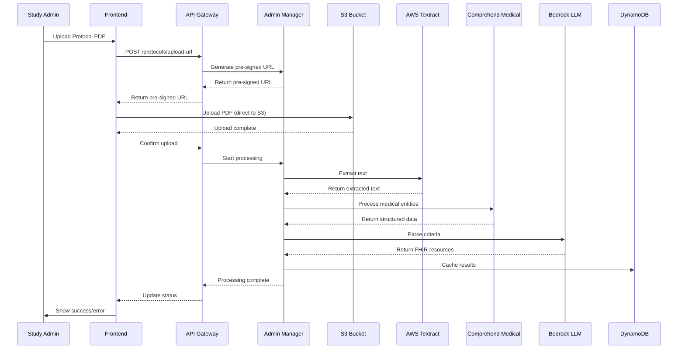
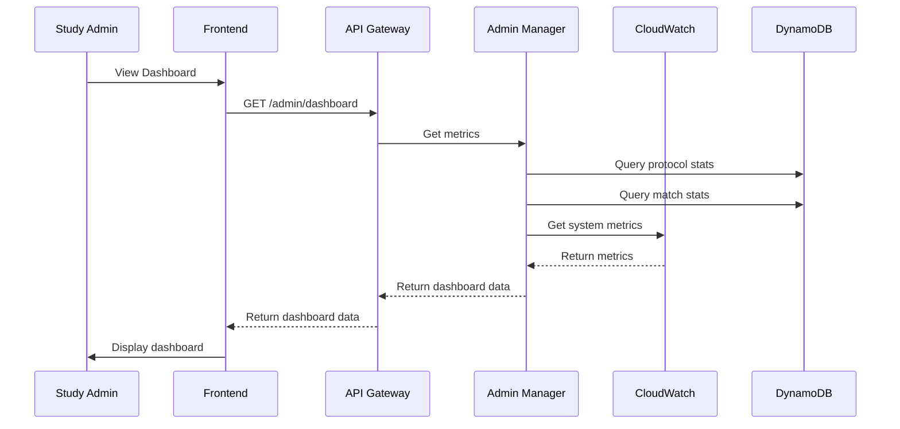

# Study Administrator Persona - Implementation Documentation

**Status**: ✅ **PRODUCTION READY**  
**Last Updated**: October 15, 2025  
**Version**: 1.0.0

---

## Overview

The Study Administrator persona is responsible for managing clinical trial protocols, monitoring system health, and ensuring compliance across the Trial Compass Pro platform. This document details all implemented functionalities for the Study Admin role.

---

## Authentication & Authorization

### Cognito Integration

- **User Pool**: Integrated with AWS Cognito User Pool
- **Group Assignment**: Users are assigned to the `StudyAdmin` group
- **JWT Token-Based Auth**: All API calls include Bearer token with group claims
- **Session Management**: Automatic token refresh and session validation

### Test Credentials

```
Username: admin_test
Password: [Configured in Cognito]
Group: StudyAdmin
Name: Admin User
Email: admin.test@example.com
```

### Role-Based Access Control (RBAC)

Study Admins have access to the following operations:

| Operation                    | Endpoint                              | Access Level        |
| ---------------------------- | ------------------------------------- | ------------------- |
| View Dashboard               | `GET /admin/dashboard`               | ✅ Full Access      |
| Monitor Processing Status    | `GET /admin/processing-status`       | ✅ Full Access      |
| View System Logs             | `GET /admin/logs`                    | ✅ Full Access      |
| View Audit Trail             | `GET /admin/audit-trail`             | ✅ Full Access      |
| Reprocess Protocol           | `POST /admin/reprocess/{trial_id}`   | ✅ Full Access      |
| Delete Protocol              | `DELETE /admin/trials/{trial_id}`    | ✅ Full Access      |
| Admin View of All Trials     | `GET /admin/trials`                  | ✅ Full Access      |

---

## Implemented Features

### 1. Dashboard & System Monitoring

#### Dashboard Overview

**Location**: `/admin/dashboard`

**Features**:
- Real-time system health metrics
- Protocol processing statistics
- Match approval workflow status
- Recent activity timeline
- Resource utilization metrics

**Key Metrics Displayed**:
- Total protocols in system
- Processing status breakdown (ready/processing/failed)
- Match approval statistics (pending/approved/rejected)
- System health indicators
- Average processing time

**Implementation Details**:
- Frontend: `trial-compass-pro/src/components/dashboards/StudyAdminDashboard.tsx`
- Backend: `aws-trial-enrollment-agent/src/lambda/admin_manager/handler.py`
- API: `GET /admin/dashboard`

### 2. Protocol Management

#### Protocol Processing Status

**Location**: `/admin/processing-status`

**Features**:
- Real-time monitoring of protocol processing pipeline
- Detailed status of each processing stage
- Error tracking and reporting
- Performance metrics

**Processing Stages Monitored**:
1. PDF Upload & Validation
2. Text Extraction (AWS Textract)
3. Section Classification
4. Criteria Parsing
5. FHIR Resource Generation
6. Cache Population

**Implementation**:
- Backend: `admin_manager/handler.py`
- API: `GET /admin/processing-status`
- Integrates with: AWS Textract, Comprehend Medical, Bedrock LLM

#### Protocol Reprocessing

**Location**: `/admin/reprocess/{trial_id}`

**Workflow**:
1. Admin selects protocol for reprocessing
2. System validates permissions
3. Original processing job is re-triggered
4. Progress is tracked in real-time
5. Results are cached upon completion

**Implementation**:
- Backend: `admin_manager/handler.py:reprocess_trial()`
- API: `POST /admin/reprocess/{trial_id}`
- Error handling with automatic retries
- Audit logging of all reprocessing actions

#### Protocol Deletion

**Location**: `/admin/trials/{trial_id}`

**Features**:
- Secure protocol removal with confirmation
- Cascading deletion of related resources
- Compliance with data retention policies
- Comprehensive audit trail

**Implementation**:
- Backend: `admin_manager/handler.py:delete_trial()`
- API: `DELETE /admin/trials/{trial_id}`
- Cleanup of S3 assets and database entries

### 3. System Administration

#### Audit Trail

**Location**: `/admin/audit-trail`

**Data Captured**:
- User actions and API calls
- Protocol uploads and modifications
- Match approvals/rejections
- System configuration changes
- Security-related events

**Filtering Capabilities**:
- Date range
- User
- Action type
- Resource type
- Status codes

**Implementation**:
- Backend: `admin_manager/handler.py:get_audit_trail()`
- API: `GET /admin/audit-trail`
- Stores data in DynamoDB with TTL for compliance

#### System Logs

**Location**: `/admin/logs`

**Features**:
- Real-time log streaming from CloudWatch
- Advanced filtering and search
- Log retention management
- Error pattern detection

**Log Sources**:
- API Gateway
- Lambda functions
- Textract/Comprehend services
- Authentication events

**Implementation**:
- Backend: `admin_manager/handler.py:get_system_logs()`
- API: `GET /admin/logs`
- CloudWatch Logs integration

---

## Data Flow

### Protocol Upload & Processing



### System Monitoring Flow



---

## API Reference

### Dashboard Endpoints

#### Get Dashboard Metrics
```
GET /admin/dashboard

Response:
{
  "metrics": {
    "total_protocols": 42,
    "active_protocols": 35,
    "processing_protocols": 3,
    "failed_protocols": 4,
    "pending_matches": 12,
    "approved_matches": 89,
    "rejected_matches": 7,
    "system_health": {
      "database": "healthy",
      "processing_pipeline": "operational",
      "api_gateway": "operational"
    },
    "avg_processing_time": 42.5
  },
  "recent_activity": [
    {
      "timestamp": "2025-10-15T10:30:00Z",
      "action": "protocol_processed",
      "trial_id": "NCT12345678",
      "status": "completed"
    },
    // ... more activities
  ]
}
```

#### Get Processing Status
```
GET /admin/processing-status

Response:
{
  "status": "operational",
  "active_processes": 2,
  "recent_errors": [],
  "queue_depth": {
    "pending_processing": 3,
    "in_progress": 2,
    "recently_completed": 5
  },
  "component_status": {
    "textract": "operational",
    "comprehend_medical": "operational",
    "bedrock_llm": "operational"
  }
}
```

### Protocol Management Endpoints

#### Reprocess Protocol
```
POST /admin/reprocess/{trial_id}

Request Body:
{
  "force": false,
  "notify_on_complete": true
}

Response:
{
  "status": "processing_started",
  "trial_id": "NCT12345678",
  "job_id": "job-12345",
  "estimated_completion": "2025-10-15T11:30:00Z"
}
```

#### Delete Protocol
```
DELETE /admin/trials/{trial_id}

Response:
{
  "status": "deleted",
  "trial_id": "NCT12345678",
  "deleted_resources": [
    "s3://bucket/protocols/NCT12345678.pdf",
    "dynamodb://criteria_cache/NCT12345678"
  ]
}
```

### System Administration Endpoints

#### Get Audit Trail
```
GET /admin/audit-trail?start_date=2025-10-01&end_date=2025-10-15&user=admin1&action=delete

Response:
{
  "events": [
    {
      "timestamp": "2025-10-15T10:30:00Z",
      "user": "admin1",
      "action": "delete_protocol",
      "resource_type": "protocol",
      "resource_id": "NCT12345678",
      "status": "success",
      "ip_address": "192.168.1.1"
    },
    // ... more events
  ],
  "total": 42,
  "next_token": "..."
}
```

#### Get System Logs
```
GET /admin/logs?log_group=/aws/lambda/ProtocolManager&start_time=2025-10-15T00:00:00Z&limit=50

Response:
{
  "logs": [
    {
      "timestamp": "2025-10-15T10:30:00.123Z",
      "level": "INFO",
      "message": "Successfully processed protocol NCT12345678",
      "request_id": "abc123",
      "duration_ms": 1234
    },
    // ... more log entries
  ],
  "next_token": "..."
}
```

---

## Error Handling

The Study Admin interface implements comprehensive error handling:

1. **Authentication Errors**: 401 for invalid/missing tokens
2. **Authorization Errors**: 403 for insufficient permissions
3. **Validation Errors**: 400 for invalid requests
4. **Not Found Errors**: 404 for non-existent resources
5. **Rate Limiting**: 429 for excessive requests
6. **Server Errors**: 500 for unexpected issues

All errors follow the standard format:
```json
{
  "error": {
    "code": "ERROR_CODE",
    "message": "Human-readable error message",
    "details": {
      // Additional error context
    }
  }
}
```

---

## Security Considerations

1. **Data Protection**:
   - All data encrypted at rest and in transit
   - PII/PHI handling in compliance with HIPAA
   - Regular security audits and penetration testing

2. **Access Control**:
   - Principle of least privilege
   - JWT-based authentication with short-lived tokens
   - IP-based access restrictions for admin endpoints

3. **Audit & Compliance**:
   - Comprehensive audit logging of all admin actions
   - Immutable audit trail
   - Regular compliance reporting

4. **Incident Response**:
   - Automated alerting for security events
   - Playbooks for common incident types
   - Regular backup and disaster recovery testing

---

## Monitoring & Alerts

The Study Admin dashboard integrates with:

1. **AWS CloudWatch**:
   - Custom metrics for system health
   - Dashboards for key performance indicators
   - Anomaly detection

2. **Scheduled Reports**:
   - Daily system status reports
   - Weekly compliance summaries
   - Monthly usage statistics

3. **Alerting**:
   - Real-time alerts for critical issues
   - Escalation policies
   - On-call rotation

---

## Future Enhancements

1. **Bulk Operations**:
   - Bulk protocol upload
   - Batch processing of protocols
   - Bulk status updates

2. **Advanced Analytics**:
   - Machine learning for anomaly detection
   - Predictive analytics for resource planning
   - Custom report generation

3. **Enhanced Security**:
   - Multi-factor authentication
   - Just-in-time access requests
   - Automated security scanning

4. **Integration**:
   - External system integrations (EDC, CTMS)
   - API for third-party tools
   - Webhook support for notifications
