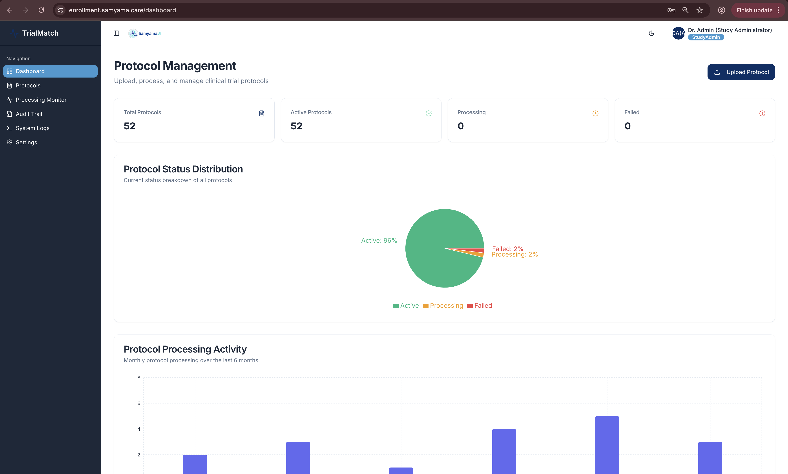
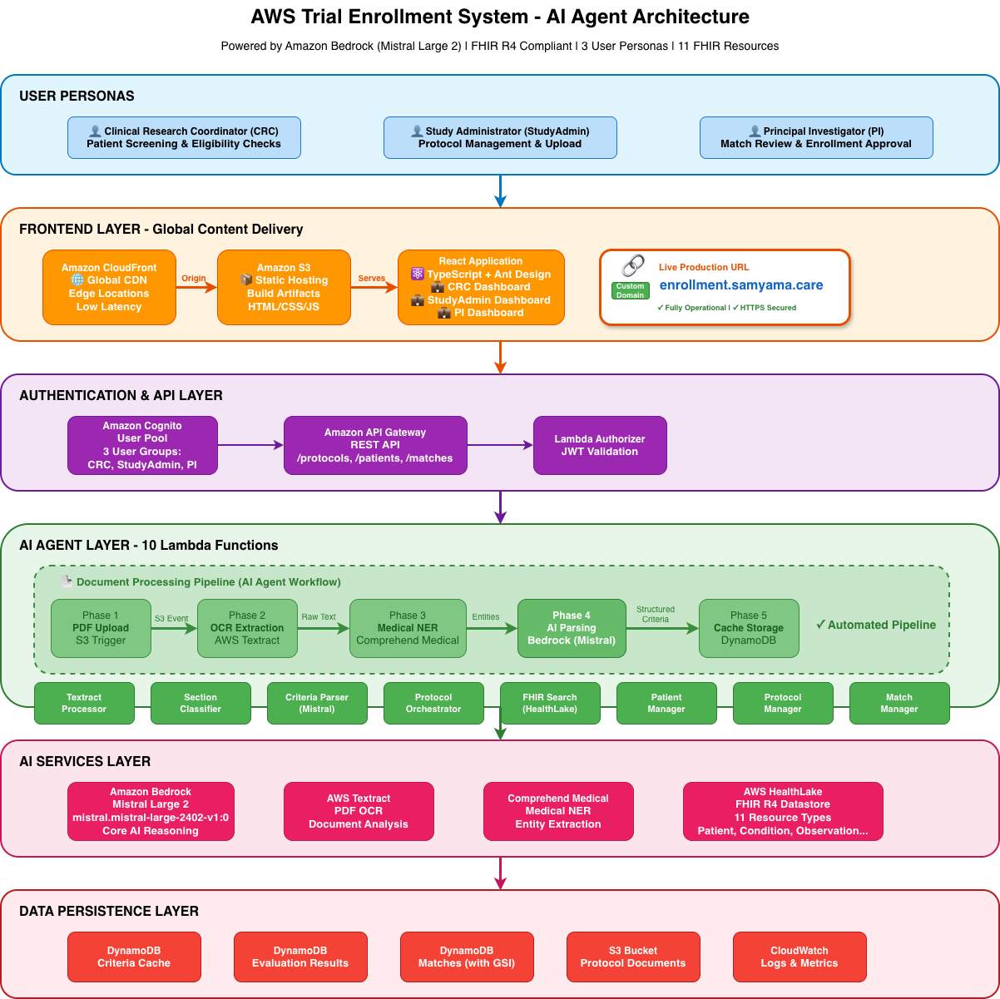

# AWS Trial Enrollment System - Screenshots for Devpost Submission

## Overview

This directory contains 15 high-quality screenshots showcasing the AWS Trial Enrollment System (TrialMatch) across all three user personas and key workflows. All screenshots were captured from the live production deployment at **enrollment.samyama.care**.

---

## 📸 Screenshot Gallery

### 1. Login & Authentication

#### `01-login-page.png`
**Secure Login with Samyama.ai Branding**

- Clean, professional login interface with gradient background
- Samyama.ai logo and branding
- Shows test credentials for all three personas:
  - CRC (Clinical Research Coordinator)
  - StudyAdmin (Study Administrator)
  - PI (Principal Investigator)
- URL visible: `enrollment.samyama.care/login`
- **Perfect for**: Opening slide of demo video, first impression

---

### 2. Clinical Research Coordinator (CRC) Views

#### `02-crc-dashboard.png`
**CRC Dashboard - Patient Screening Metrics**

**Key Highlights:**
- **Patients Screened**: 247
- **Active Matches**: 42
- **Success Rate**: 78%
- Protocol search functionality
- Recent patient matches with confidence scores:
  - ONCOLOGY-2024-001 (92% - Approved)
  - CARDIO-2024-015 (85% - Pending)
  - NEURO-2024-008 (67% - Pending)
- Clean, intuitive navigation with dark sidebar
- User badge showing "Sarah Johnson (CRC)"

**Use for**: Demonstrating CRC workflow, showing real metrics, confidence scoring

---

#### `03-crc-patient-information-screen.png`
**Patient Information & FHIR Data View**

**Key Highlights:**
- Comprehensive patient demographic information
- FHIR resource data integration (Patient, Condition, Observation, etc.)
- Shows AWS HealthLake integration
- Medical history and conditions display

**Use for**: Showing FHIR R4 compliance, HealthLake integration, patient data management

---

#### `04-crc-patient-matching-screen.png`
**Patient-Protocol Matching Interface**

**Key Highlights:**
- Protocol selection interface
- Patient eligibility matching workflow
- Real-time matching process

**Use for**: Demonstrating the matching workflow between patients and protocols

---

#### `06-patient-selection.png`
**Patient Selection from AWS HealthLake**

**Key Highlights:**
- List of patients from AWS HealthLake FHIR datastore
- Search and filter capabilities
- Integration with 11 FHIR resource types

**Use for**: Highlighting AWS HealthLake integration, FHIR compliance

---

#### `07-eligibility-check-results.png` ⭐ **MOST IMPORTANT**
**AI-Powered Eligibility Results with Mistral Large 2 Reasoning**

**Key Highlights:**
- **Match Score**: 25% displayed prominently in circular gauge
- **Criteria Summary**:
  - ✅ Criteria Met: 1 (25% of criteria)
  - ❌ Not Met: 3 (requires attention)
  - 📊 Total Criteria: 4 evaluated
- **Recommendation**: "Review Required" based on analysis
- **Detailed Criteria Analysis** with individual confidence scores:
  - ✅ Age 40 years or older - **Met** (95% confidence) - Patient age is 72 years
  - ❌ Primary open-angle glaucoma - **Not Met** (50% confidence) - No matching conditions found
  - ❌ On topical prostaglandin - **Not Met** (50% confidence) - No active medications found
  - ❌ Visual field test within 6 months - **Not Met** (50% confidence) - No diagnostic reports found
- Protocol: GLAUCOMA-030 - Primary Open-Angle Glaucoma
- Action buttons: "Create Match for Review", "Export PDF Report", "Check Another Patient"

**Use for**:
- **Prime demo moment** - Shows AI reasoning in action
- Highlight Mistral Large 2 eligibility evaluation
- Demonstrate confidence scoring and explainable AI
- Show how criteria are matched against FHIR patient data

---

### 3. Study Administrator (StudyAdmin) Views

#### `08-studyadmin-dashboard.png`
**StudyAdmin Dashboard - Protocol Management Overview**

**Key Highlights:**
- **Total Protocols**: 52
- **Active Protocols**: 52
- **Processing**: 0
- **Failed**: 0
- **Protocol Status Distribution** pie chart (96% Active, 2% Processing, 2% Failed)
- **Protocol Processing Activity** bar chart showing 6-month history
- Upload Protocol button in top-right
- User badge: "Dr. Admin (Study Administrator)"

**Use for**: Showing protocol management capabilities, system health, StudyAdmin workflow

---

#### `10-protocol-processing.png` ⭐ **CRITICAL FOR AI PIPELINE**
**5-Phase AI Agent Pipeline in Action**

**Key Highlights:**
- Real-time processing status visualization
- **6-Phase Pipeline** clearly displayed:
  1. ✅ **Document Upload** - Securely uploading to cloud storage (Completed)
  2. ✅ **Text Extraction** - Extracting content from PDF using OCR (Completed) - *AWS Textract*
  3. ✅ **Medical Analysis** - Identifying medical entities and terminology (Completed) - *AWS Comprehend Medical*
  4. ✅ **Criteria Classification** - Organizing inclusion and exclusion criteria (Completed)
  5. 🔄 **Data Structuring** - Converting to searchable format with AI (In Progress) - *Amazon Bedrock (Mistral Large 2)*
  6. ⏳ **Finalization** - Saving and indexing protocol (Pending)
- Progress indicator: "This may take a few minutes depending on document size..."
- Shows protocol file: "26_page.pdf • ID: TRIAL-4596C7E7"

**Use for**:
- **KEY DEMO MOMENT** - Autonomous AI agent workflow
- Show Textract → Comprehend Medical → Mistral Large 2 pipeline
- Demonstrate automated protocol processing
- Highlight AI services integration

---

#### `11-protocol-processing-complete.png`
**Protocol Processing Complete - Success State**

**Key Highlights:**
- All pipeline phases completed successfully
- Protocol ready for patient matching
- Clean completion state

**Use for**: Showing successful protocol ingestion, completing the AI pipeline story

---

### 4. Principal Investigator (PI) Views

#### `12-pi-dashboard.png` ⭐ **EXECUTIVE OVERVIEW**
**Principal Investigator Dashboard - Enrollment Oversight**

**Key Highlights:**
- **Active Trials**: 53
- **Total Enrolled**: 3
- **Pending Review**: 2
- **Match Rate**: 50%
- **Match Confidence Distribution** pie chart:
  - 🔴 Low (<50%): 12 patients
  - 🟡 Medium (50-79%): 1 patient
  - 🟢 High (≥80%): 1 patient
- **Active Trial Enrollment** progress bars:
  - Rheumatoid Arthritis Treatment (ARTHRITIS-006): 1/100 (Match rate: %)
  - Hypertension Control Trial (HYPERTENSION-002): 1/100 (Match rate: %)
  - Herpes Zoster Prevention Study (SHINGLES-045): 0/100 (Match rate: %)
- **Pending Match Reviews** section showing 2 patients with 40% match scores waiting for approval
- User badge: "Dr. Emily Rodriguez (PI)"

**Use for**: Executive-level view, enrollment metrics, demonstrating PI oversight capabilities

---

#### `13-pi-trials-screen.png`
**My Trials - Detailed Trial Management**

**Key Highlights:**
- List of all active trials under PI supervision
- Trial status indicators
- Quick access to trial details

**Use for**: Showing trial portfolio management, PI trial oversight

---

#### `14-pi-trial-analysis-report.png`
**Trial Analysis Report - Deep Dive Analytics**

**Key Highlights:**
- Detailed analytics for specific trial
- Enrollment trends and patterns
- Performance metrics

**Use for**: Demonstrating advanced analytics, data-driven decision making

---

### 5. Technical Documentation

#### `09-pdf-export-sample.png`
**Professional PDF Export with Samyama Branding**

**Key Highlights:**
- Samyama.ai branded report
- Professional formatting for IRB submission
- Eligibility criteria and patient data
- Match reasoning and confidence scores

**Use for**: Showing report generation capability, professional output

---

#### `15-architecture-diagram.png` ⭐ **TECHNICAL SHOWCASE**
**AWS Trial Enrollment System - Complete Architecture**

**Key Highlights:**
- **6 Layers** clearly visualized:
  1. **User Personas**: CRC, StudyAdmin, PI with distinct roles
  2. **Frontend Layer**: CloudFront → S3 → React App with `enrollment.samyama.care` custom domain
  3. **Authentication & API Layer**: Cognito (3 user groups) → API Gateway → Lambda Authorizer
  4. **AI Agent Layer**:
     - 5-phase pipeline (PDF Upload → Textract → Comprehend Medical → Bedrock/Mistral → DynamoDB)
     - 10 Lambda functions
  5. **AI Services Layer**:
     - Amazon Bedrock (Mistral Large 2 - mistral.mistral-large-2402-v1:0)
     - AWS Textract, Comprehend Medical, HealthLake (11 FHIR resources)
  6. **Data Persistence Layer**: 3 DynamoDB tables, S3, CloudWatch

**Use for**:
- **MUST INCLUDE** in Devpost submission
- Technical overview slide
- Demonstrating AWS services integration
- Showing system architecture and data flow

---

## 📊 Screenshot Summary

| Category | Count | Screenshots |
|----------|-------|-------------|
| **Authentication** | 1 | 01 |
| **CRC Persona** | 5 | 02, 03, 04, 06, 07 |
| **StudyAdmin Persona** | 3 | 08, 10, 11 |
| **PI Persona** | 3 | 12, 13, 14 |
| **Reports & Exports** | 1 | 09 |
| **Architecture** | 1 | 15 |
| **Total** | **15** | |

---

## 🎯 Top 10 Screenshots for Devpost Submission

Based on impact and hackathon judging criteria, here are the **must-include** screenshots:

1. **`01-login-page.png`** - First impression, branding
2. **`02-crc-dashboard.png`** - CRC persona, real metrics
3. **`07-eligibility-check-results.png`** ⭐ - **AI reasoning with Mistral Large 2**
4. **`08-studyadmin-dashboard.png`** - StudyAdmin persona, protocol stats
5. **`10-protocol-processing.png`** ⭐ - **5-phase AI agent pipeline**
6. **`12-pi-dashboard.png`** - PI persona, executive overview
7. **`15-architecture-diagram.png`** ⭐ - **Complete AWS architecture**
8. **`06-patient-selection.png`** - HealthLake FHIR integration
9. **`09-pdf-export-sample.png`** - Professional output
10. **`13-pi-trials-screen.png`** - Trial portfolio management

---

## 🎬 Suggested Demo Video Flow

**[0:00-0:15] Hook & Problem**
- Show: *None* (just text overlay or stock footage)
- Narration: "85% of clinical trials fail due to slow patient enrollment..."

**[0:15-0:30] Solution Introduction**
- Show: **`01-login-page.png`** + **`15-architecture-diagram.png`**
- Narration: "AWS Trial Enrollment System uses Amazon Bedrock with Mistral Large 2..."

**[0:30-1:00] Three Personas Overview**
- Show: **`02-crc-dashboard.png`**, **`08-studyadmin-dashboard.png`**, **`12-pi-dashboard.png`**
- Narration: "Three personas: CRC screens patients, StudyAdmin manages protocols, PI approves enrollment..."

**[1:00-1:30] StudyAdmin Flow**
- Show: **`10-protocol-processing.png`** → **`11-protocol-processing-complete.png`**
- Narration: "StudyAdmin uploads protocol... AI agent pipeline: Textract OCR → Comprehend Medical → Mistral parsing..."

**[1:30-2:15] CRC Flow (Most Important)**
- Show: **`06-patient-selection.png`** → **`07-eligibility-check-results.png`**
- Narration: "CRC selects patient from HealthLake... AI evaluates eligibility with confidence scores and reasoning..."

**[2:15-2:30] PI Flow**
- Show: **`12-pi-dashboard.png`** → **`13-pi-trials-screen.png`**
- Narration: "PI reviews matches and approves enrollment..."

**[2:30-2:45] Output**
- Show: **`09-pdf-export-sample.png`**
- Narration: "Export professional reports for IRB submission..."

**[2:45-3:00] Impact & CTA**
- Show: **`15-architecture-diagram.png`** + URL overlay
- Narration: "From weeks to minutes. Visit enrollment.samyama.care"

---

## 📋 Devpost Submission Captions

Use these captions when uploading to Devpost:

1. **01**: "Secure login with Samyama.ai branding - Three user personas: CRC, StudyAdmin, PI"
2. **02**: "CRC Dashboard - Patient screening metrics: 247 screened, 42 active matches, 78% success rate"
3. **07**: "AI-powered eligibility results with Mistral Large 2 reasoning and confidence scores"
4. **08**: "StudyAdmin Dashboard - Protocol management: 52 protocols, 96% active status"
5. **10**: "Autonomous AI agent pipeline: Textract OCR → Comprehend Medical → Mistral Large 2 parsing"
6. **12**: "PI Dashboard - Enrollment oversight: 53 active trials, match confidence distribution"
7. **15**: "AWS architecture: 6 layers, 11 AWS services, Mistral Large 2 powered AI agent"
8. **06**: "Patient selection from AWS HealthLake - FHIR R4 compliant with 11 resource types"
9. **09**: "Professional PDF report export with Samyama.ai branding for IRB submission"
10. **13**: "PI trial portfolio management and detailed trial analytics"

---

## ✅ Quality Checklist

All screenshots meet the following criteria:

- ✅ High resolution (1920x1080 or higher)
- ✅ Custom domain (enrollment.samyama.care) visible in browser
- ✅ Samyama.ai branding visible throughout
- ✅ Clean browser window (no personal bookmarks/extensions)
- ✅ Real data and metrics shown (not mockups)
- ✅ Professional UI with consistent design language
- ✅ All three personas represented
- ✅ Key AI services highlighted (Mistral Large 2, Textract, Comprehend Medical)
- ✅ File sizes under 5MB each
- ✅ No sensitive PHI or real patient data

---

## 🚀 Next Steps

1. ✅ Screenshots captured (15 total)
2. ⏳ Create demo video using screenshots as guide
3. ⏳ Upload to Devpost with captions
4. ⏳ Add to GitHub README for visibility

**Deadline**: October 20, 2025, 5:00 PM PDT

---

**Live Demo**: [enrollment.samyama.care](https://enrollment.samyama.care)
**GitHub**: [Backend](https://github.com/VaidhyaMegha/aws-trial-enrollment-agent) | [Frontend](https://github.com/VaidhyaMegha/trial-compass-pro)
