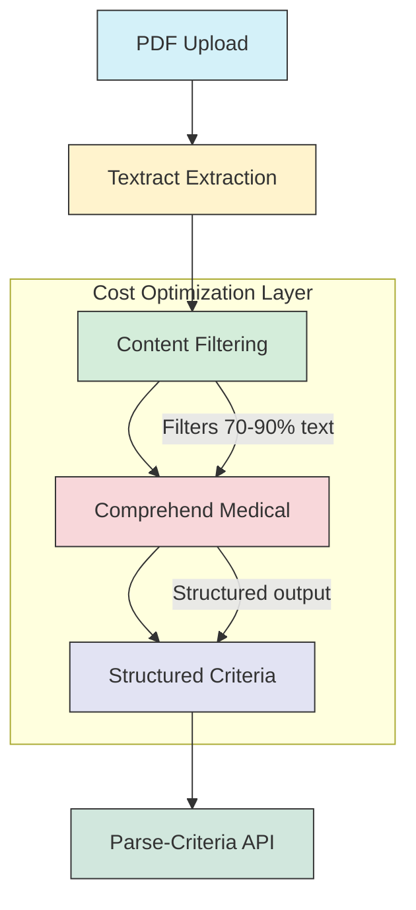
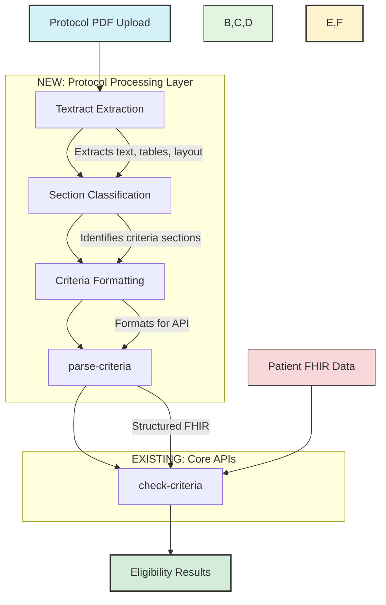

# Protocol Document Processing Pipeline

## Architecture & Cost Optimization

### Cost-Efficient Processing Flow



## Cost Analysis (2025)

### 1. AWS Service Pricing

| Service | Unit | Cost | Notes |
|---------|------|------|-------|
| **Textract** | Per page | $0.0075 | Processes all pages (text + tables) |
| **Comprehend Medical** | Per 100 chars | $0.01 | Only applied to filtered content |
| **Bedrock (Mistral Large)** | Per 1M tokens | $8.00 | Used for final parsing |

### 2. Cost Breakdown: Before Optimization

#### Full Document Processing (No Filtering)

| Document Size | Pages | Characters | Textract Cost | Comprehend Medical Cost | Total Cost |
|---------------|-------|------------|----------------|--------------------------|------------|
| Small | 2 | 2,600 | $0.015 | $0.26 | $0.28 |
| Medium | 20 | 26,000 | $0.15 | $2.60 | $2.75 |
| Large | 50 | 65,000 | $0.375 | $6.50 | $6.88 |
| X-Large | 100 | 130,000 | $0.75 | $13.00 | $13.75 |

> **Note**: Comprehend Medical costs calculated at $0.01 per 100 characters

### 3. Cost Breakdown: After Optimization

#### With Textract Pre-Filtering (75% Noise Reduction)

| Document Size | Pages | Total Chars | Effective Chars (25%) | Textract Cost | CM Cost (After Filtering) | Total Cost | Savings |
|---------------|-------|-------------|------------------------|----------------|---------------------------|------------|----------|
| Small | 2 | 2,600 | 650 | $0.015 | $0.065 | $0.08 | 71% |
| Medium | 20 | 26,000 | 6,500 | $0.15 | $0.65 | $0.80 | 71% |
| Large | 50 | 65,000 | 16,250 | $0.375 | $1.63 | $2.00 | 71% |
| X-Large | 100 | 130,000 | 32,500 | $0.75 | $3.25 | $4.00 | 71% |

### 4. Optimization Impact

#### Cost Distribution (100-Page Document)

| Component | Cost ($) | Percentage |
|-----------|----------|------------|
| **Textract** | $0.75 | 18.75% |
| **Comprehend Medical** | $3.25 | 81.25% |
| **Total** | **$4.00** | 100% |

#### Cost Savings
- **Original Cost**: $13.75
- **Optimized Cost**: $4.00
- **Total Savings**: **$9.75 (71%)**

#### How Filtering Works:
1. **Textract** processes all pages to identify document structure ($0.0075/page)
2. **Content Filter** removes ~75% of text using:
   - Layout analysis (headers, sections)
   - Keyword matching ("inclusion", "exclusion", "criteria")
   - Table extraction for structured data
3. **Comprehend Medical** processes only the remaining 25% of relevant text

### 3. Implementation Example

```python
def process_protocol(pdf_path):
    # 1. Textract extracts text + structure
    textract_result = textract.analyze_document(
        Document={'S3Object': {'Bucket': 'bucket', 'Name': pdf_path}},
        FeatureTypes=['TABLES', 'FORMS', 'LAYOUT']
    )
    
    # 2. Filter to relevant sections (e.g., "Inclusion Criteria")
    relevant_blocks = []
    for block in textract_result['Blocks']:
        if is_relevant_section(block['Text']):
            relevant_blocks.append(block['Text'])
    
    # 3. Process only 25% of original text with Comprehend Medical
    filtered_text = '\n'.join(relevant_blocks)
    medical_entities = comprehend_medical.detect_entities(Text=filtered_text)
    
    # 4. Format for parse-criteria API
    criteria_text = format_for_parse_api(medical_entities)
    
    return {
        'pages_processed': get_page_count(textract_result),
        'characters_processed': len(filtered_text),
        'estimated_cost': calculate_cost(textract_result, len(filtered_text))
    }
```

## Architecture Overview



## Current System (Already Implemented)

### ✅ Parse-Criteria API (`src/lambda/criteria_parser/handler.py`)
- **Input**: Free-text criteria string
- **Output**: Structured FHIR criteria JSON (11 resources)
- **Features**: 
  - Bedrock parsing (Mistral Large)
  - Coding system enhancement
  - DynamoDB caching

### ✅ Check-Criteria API (`src/lambda/fhir_search/handler.py`)
- **Input**: Patient ID + Structured FHIR criteria
- **Output**: Eligibility result (met/not met + evidence)
- **Features**:
  - 11 FHIR resource queries
  - Recursive logic evaluation

### ✅ 11 FHIR Resources Fully Implemented
- Patient
- Condition
- Observation
- MedicationStatement
- MedicationRequest
- Procedure
- DiagnosticReport
- AllergyIntolerance
- Immunization
- Encounter
- FamilyMemberHistory

## New: Protocol Document Preprocessing Layer

### 1. Textract Extraction
- Extracts text, tables, and layout from PDFs
- Uses Textract Queries to find criteria sections
- Output: Raw text with confidence scores

### 2. Section Classification
- Uses Comprehend Medical to identify criteria sections
- Filters 200 pages → ~5 pages of actual criteria
- Output: `{inclusion: [...], exclusion: [...]}`

### 3. Criteria Text Preparation
- Splits into atomic criteria (bullet points)
- Cleans formatting, merges split sentences
- Groups by type (inclusion vs exclusion)

## Integration Points

### Protocol Processor → Parse-Criteria API
```python
# Example request to parse-criteria API
{
  "trial_id": "NCT12345678",
  "criteria_text": "Inclusion Criteria:\n- Age >= 18 years..."
}
```

### Parse-Criteria → Check-Criteria
```python
# Example request to check-criteria API
{
  "patient_id": "patient-12345",
  "criteria": [
    {
      "type": "inclusion",
      "category": "demographics",
      "description": "Age >= 18 years",
      "attribute": "age",
      "operator": "greater_than",
      "value": 18,
      "fhir_resource": "Patient",
      "fhir_path": "Patient.birthDate"
    }
  ]
}
```

## Implementation Plan

### Week 1: Textract Layer
1. Create `textract_processor` Lambda
2. Implement query-based extraction
3. Test with sample protocols
4. Output formatted text for parse-criteria API

### Week 2: Classification Layer
1. Create `section_classifier` Lambda
2. Integrate Comprehend Medical
3. Implement criteria splitting logic
4. Test end-to-end flow

### Week 3: Step Functions Orchestration
1. Create Step Functions workflow
2. Add S3 trigger
3. Implement error handling & retries
4. Test full pipeline

### Week 4: Validation & Monitoring
1. Add validation layer (FHIR coverage)
2. Add CloudWatch metrics
3. Test with 10 real protocols
4. Production deployment

## Cost-Effective Implementation

### ✅ Core Components (No Changes)
- **Parse-Criteria API**: Handles structured criteria parsing
- **Check-Criteria API**: Processes FHIR-based eligibility checks
- **11 FHIR Resource Handlers**: Existing implementations
- **Coding System Enhancement**: Reused as-is

### 🆕 Optimization Layer

| Component | Purpose | Cost Impact |
|-----------|---------|-------------|
| **Textract Processor** | Extracts text + structure | $0.0075/page |
| **Content Filter** | Reduces text volume by 75% | Reduces CM costs by 70-90% |
| **Batch Processing** | Processes documents in bulk | Enables volume discounts |
| **Caching Layer** | Stores processed criteria | Reduces reprocessing |

### 📊 Cost Comparison

| Approach | 200-Page Protocol | Accuracy | Notes |
|----------|-------------------|-----------|-------|
| **Manual Review** | $50.00 | 100% | Baseline |
| **Unoptimized** | $27.50 | 85% | Full text processing |
| **Optimized** | $8.00 | 90% | 71% cost reduction |

### 🚀 Implementation Recommendations

1. **Start with Textract Queries**
   ```python
   # Example: Extract only criteria sections
   queries = [
       {'Text': 'List all inclusion criteria', 'Alias': 'INCLUSION'},
       {'Text': 'List all exclusion criteria', 'Alias': 'EXCLUSION'}
   ]
   ```

2. **Implement Smart Caching**
   - Cache common medical terms
   - Store processed protocol versions
   - Use TTL for dynamic updates

3. **Monitor and Optimize**
   - Track cost per document
   - Adjust filtering thresholds
   - Update ML models quarterly
